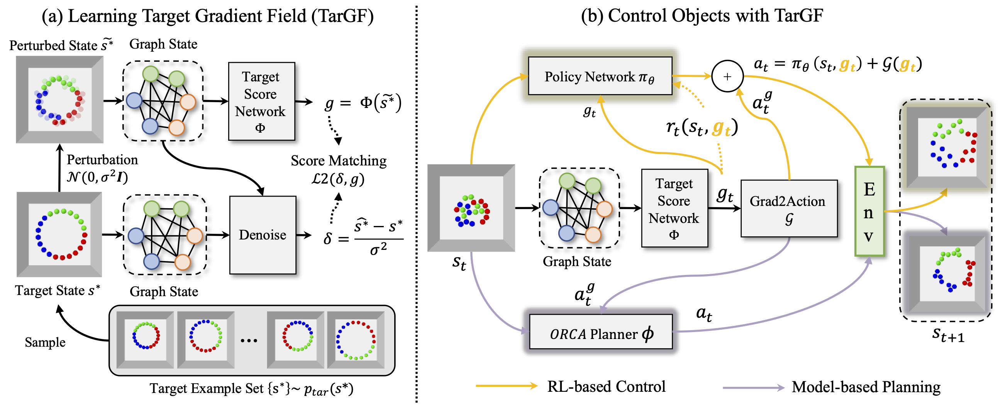
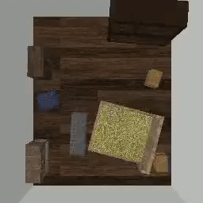

# TarGF: Learning Target Gradient Field to Rearrange Objects without Explicit Goal Specification

[[Website](https://sites.google.com/view/targf/)] [[Arxiv](https://arxiv.org/abs/2209.00853)]


 

The agent is given examples from a target distribution and aims at rearranging objects to increase the likelihood of the distribution. Our key idea is to learn a **target gradient field** that indicates the fastest direction to increase the likelihood from examples via score-matching. We further incoporates the target gradient field with reinforcement learning or model-based planner to tackle this task in model-free and model-based setting respectively.

The environments used in this work are demonstrated as follows:

| *Circling* | *Clustering* | *Circling + Clustering* | *Room Rearrangement* |
|  ----  | ----  | ----  | ----  |
|  |   |     |  |

This repo is the official implementation of [TarGF](https://arxiv.org/abs/2209.00853). Contents of this repo are as follows:

- [Installation](#Installation)
  - [Requirements](#Requirements)
  - [Install Global Dependencies](#Install-Global-Dependencies)
  - [Install *Ball Rearrangement* Dependencies](#Install-Ball-Rearrangement-Dependencies)
  - [Install *Room Rearrangement* Dependencies](#Install-Room-Rearrangement-Dependencies)
- [Training](#Training)
  - [Target Score Network](#Training-the-Target-Score-Network)
  - [*Ours (SAC)*](#Training-SAC-with-TarGF)
- [Evaluation](#Evaluation)
  - [*Ours (ORCA)*](#For-TarGF-(ORCA))
  - [*Ours (SAC)*](#For-TarGF-(SAC))
- [Note](#Note)
- [Citation](#Citation)
- [Contact](#Contact)
- [License](#License)


## Installation

### Requirements
- Ubuntu >= 18.04
- Anaconda3 
- python >= 3.9
- pytorch >= 1.11.0
- pytorch_geometric >= 2.0.0
- pybullet >= 3.1.0
- tensorboard >= 2.6.0
- pytorch_fid >= 0.2.0
- imageio >= 2.9.0

### Install Global Dependencies

```
git clone https://github.com/AaronAnima/TarGF

cd TarGF

conda create -n targf python=3.9

conda activate targf

conda install pytorch==1.11.0 torchvision==0.12.0 torchaudio==0.11.0 cudatoolkit=11.3 -c pytorch

conda install pyg==2.0.4 -c pyg

pip install opencv-python tensorboard pytorch_fid ipdb imageio 
```

### Install *Ball* Rearrangement Environment

```
pip install gym pybullet

cd Envs

git clone https://github.com/AaronAnima/EbOR # install Example-based Object Rearrangement (EbOR) environments

cd EbOR

pip install -e .

cd ../../
```


### Install *Room Rearrangement* Environment

Please follow the README in [this page](https://github.com/AaronAnima/TarGF/tree/main/Envs/Room).

If you do not need to run this experiment, you can skip this procedure. 


## Training 
We assign an argument `--log_dir $log_dir` for each experiment. The in-process results will be saved in `../logs/${log_dir}`.

### Training the Target Score Network
**Note:** *To reproduce the results in the paper, please change `--n_samples 10000` to `--n_samples 100000` for all the ball rearrangement experiments.*

To rearrange balls into a circle (*Circling*):
```
python Runners/Train/BallSDE.py --log_dir Circle_Score --data_name Circle_Examples --pattern Circle --num_per_class 7 --num_classes 3 --n_samples 10000
```


To cluster the balls into three groups according to the color (*Clustering*):
```
python Runners/Train/BallSDE.py --log_dir Cluster_Score --data_name Cluster_Examples --pattern Cluster --num_per_class 7 --num_classes 3 --n_samples 10000
```


To rearrange balls into a circle and cluster the balls with the same color (*Circling+Clustering*):
```
python Runners/Train/BallSDE.py --log_dir CircleCluster_Score --data_name CircleCluster_Examples --pattern CircleCluster --num_per_class 7 --num_classes 3 --n_samples 10000
```


To rearrange the random placed furniture in a room (*Room Rearrangement*):
```
python Runners/Train/RoomSDE.py --log_dir Room_Score --data_name UnShuffledRoomsMeta
```

You can also *visualise* the in-process results via `TensorBoard`:
```
tensorboard --logdir ../logs/${log_dir}/tb --port 10020
```
where `${log_dir}` denotes the argument following `--log_dir`.

### Learning to control with RL and TarGF (Optional)
The TarGF provides reference actions and rewards in reinforcement learning (RL). Here we choose SAC as the RL algorithm.
This is an optional procedure. If you do not need to run this experiment, you can skip this procedure. 
You can use the ORCA planner to control the balls in the *Ball Rearrangement* environment.
Note that ORCA only supports *Ball Rearrangement* environment. For *Room Rearrangement*, please use the *TarGF (SAC)*.
**Note:** *To reproduce the results in the paper, please change `--residual_t0 0.01` to `--residual_t0 0.1` for all the ball rearrangement experiments.*

For *Circling*:
```
python Runners/Train/BallSAC.py --log_dir Circle_SAC --pattern Circle --num_per_class 7 --num_classes 3 --lambda_col 3.0 --lambda_sim 1.0 --score_exp Circle_Score --residual_t0 0.01 
```


For *Clustering*:
```
python Runners/Train/BallSAC.py --log_dir Cluster_SAC --pattern Cluster --num_per_class 7 --num_classes 3 --lambda_col 5.0 --lambda_sim 1.0 --score_exp Cluster_Score --residual_t0 0.01 
```


For *Circling+Clustering*:
```
python Runners/Train/BallSAC.py --log_dir CircleCluster_SAC --pattern Circle --num_per_class 7 --num_classes 3 --lambda_col 5.0 --lambda_sim 1.0 --score_exp CircleCluster_Score --residual_t0 0.01 
```


For *Room Rearrangement*:
```
python Runners/Train/RoomSAC.py --log_dir Room_SAC --score_exp Room_Score
```


## Evaluation
We also assign an argument `--log_dir $log_dir` for each experiment. The metrics dict, trajectories and visualisations will be saved in `../logs/${log_dir}`.


### For *TarGF (ORCA)*

**Note:** *To reproduce the results in the paper, please change `--residual_t0 0.01` to `--residual_t0 0.1` and `--is_decay False` to `--is_decay True` for all the ball rearrangement experiments.*

For *Circling*:

```
python Runners/Eval/BallEvalPolicy.py --log_dir Circle_ORCA --pattern Circle --num_per_class 7 --num_classes 3 --policy_mode ORCA --score_exp Circle_Score --eval_mode full_metric --residual_t0 0.01 --is_decay False
```


For *Clustering*:
```
python Runners/Eval/BallEvalPolicy.py --log_dir Cluster_ORCA --pattern Cluster --num_per_class 7 --num_classes 3 --policy_mode ORCA --score_exp Cluster_Score --eval_mode full_metric --residual_t0 0.01 --is_decay False
```


For *Circling+Clustering*:
```
python Runners/Eval/BallEvalPolicy.py --log_dir CircleCluster_ORCA --pattern CircleCluster --num_per_class 7 --num_classes 3 --policy_mode ORCA --score_exp CircleCluster_Score --eval_mode full_metric --residual_t0 0.01 --is_decay False
```

To obtain qualitative results, change the `--eval_mode full_metric` to `--eval_mode analysis`.
The visualisations will be saved in `../logs/${log_dir}`


### For *TarGF (SAC)*

**Note:** *To reproduce the results in the paper, please change `--residual_t0 0.01` to `--residual_t0 0.1` for all the ball rearrangement experiments.*

For *Circling*:
```
python Runners/Eval/BallEvalPolicy.py --log_dir Circling_SAC --pattern Circle --num_per_class 7 --num_classes 3 --policy_mode SAC --score_exp Circling_Score --eval_mode full_metric --residual_t0 0.01
```


For *Clustering*:
```
python Runners/Eval/BallEvalPolicy.py --log_dir Clustering_SAC --pattern Cluster --num_per_class 7 --num_classes 3 --policy_mode SAC --score_exp Clustering_Score --eval_mode full_metric --residual_t0 0.01
```


For *Circling+Clustering*:
```
python Runners/Eval/BallEvalPolicy.py --log_dir CircleCluster_SAC --pattern CircleCluster --num_per_class 7 --num_classes 3 --policy_mode SAC --score_exp CircleCluster_Score --eval_mode full_metric --residual_t0 0.01
```


For *Room Rearrangement*:
```
python Runners/Eval/RoomEvalPolicy.py --log_dir Room_SAC --score_exp Room_Score --save_video True
```

To obtain qualitative results of *Ball Rearrangmenet*, change the `--eval_mode full_metric` to `--eval_mode analysis`.
The results will be saved in `../logs/analysis_${log_dir}`.


## Citation
```
@inproceedings{
wu2022targf,
title={Tar{GF}: Learning Target Gradient Field for Object Rearrangement},
author={Mingdong Wu and Fangwei Zhong and Yulong Xia and Hao Dong},
booktitle={Advances in Neural Information Processing Systems},
editor={Alice H. Oh and Alekh Agarwal and Danielle Belgrave and Kyunghyun Cho},
year={2022},
url={https://openreview.net/forum?id=Euv1nXN98P3}
}

```

## Contact
If you have any suggestion or questions, please get in touch at [wmingd@pku.edu.cn](wmingd@pku.edu.cn) or [zfw@pku.edu.cn](zfw@pku.edu.cn).

## LICENSE
TarGF has an MIT license, as found in the [LICENSE](./LICENSE) file.


