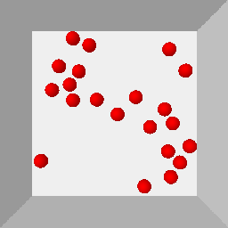
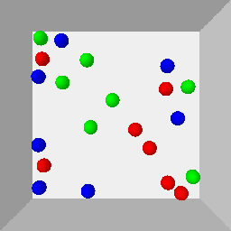
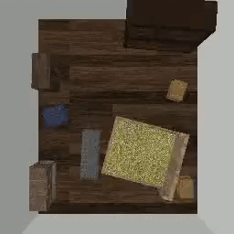

# TarGF: Learning Target Gradient Field to Rearrange Objects without Explicit Goal Specification

[[Website](https://sites.google.com/view/targf/)] [[Arxiv](https://arxiv.org/abs/2209.00853)]


 

The agent is given examples from a target distribution and aims at rearranging objects to increase the likelihood of the distribution. Our key idea is to learn a **target gradient field** that indicates the fastest direction to increase the likelihood from examples via score-matching. We further incoporates the target gradient field with reinforcement learning or model-based planner to tackle this task in model-free and model-based setting respectively.

The environments used in this work are demonstrated as follows:

| *Circling* | *Clustering* | *Circling + Clustering* | *Room Rearrangement* |
|  ----  | ----  | ----  | ----  |
|  |   |     |  |

This repo is an on-going rebuild of the official implementation in the [main branch](https://github.com/AaronAnima/TarGF/tree/main). Contents of this repo are as follows:

- [Installation](#installation)
  - [Requirements](#requirements)
  - [Install Global Dependencies](#install-global-dependencies)
  - [Install *Ball Rearrangement* Dependencies](#install-ball-rearrangement-environment)
  - [Install *Room Rearrangement* Dependencies](#install-room-rearrangement-environment)
- [Training](#training)
  - [Target Score Network](#training-the-target-score-network)
  - [Learning to control with RL and TarGF (Optional)](#learning-to-control-with-rl-and-targf-optional)
- [Evaluation](#evaluation)
- [Citation](#citation)
- [Contact](#contact)
- [License](#license)


## Installation

### Requirements
- Ubuntu >= 18.04
- Anaconda3 
- python >= 3.9
- pytorch >= 1.11.0
- pytorch_geometric >= 2.0.0
- pybullet >= 3.1.0
- tensorboard >= 2.6.0
- pytorch_fid >= 0.2.0
- imageio >= 2.9.0

### Install Global Dependencies

```
git clone https://github.com/AaronAnima/TarGF

cd TarGF

conda create -n targf python=3.9

conda activate targf

conda install pytorch==1.11.0 torchvision==0.12.0 torchaudio==0.11.0 cudatoolkit=11.3 -c pytorch

conda install pyg==2.0.4 -c pyg

pip install opencv-python tensorboard pytorch_fid ipdb imageio 
```

### Install *Ball* Rearrangement Environment

```
pip install gym pybullet

cd Envs

git clone https://github.com/AaronAnima/EbOR # install Example-based Object Rearrangement (EbOR) environments

cd EbOR

pip install -e .

cd ../../
```


### Install *Room Rearrangement* Environment

Please follow the README in [this page](https://github.com/AaronAnima/TarGF/tree/main/Envs/Room).

If you do not need to run this experiment, you can skip this procedure. 


## Training 
We assign an argument `--log_dir $log_dir` for each experiment. The in-process results will be saved in `../logs/${log_dir}`.

### Training the Target Score Network
**Note:** *To reproduce the results in the paper, please change `config.n_samples = 10000` to `config.n_samples = 100000` in `./configs/targf_ball_base.py`*

Set `--mode train_gf` and set config files for specifying different tasks. The in-process results and the model checkpoint will be saved in `./logs/${workdir}`.
For example, for *Room Rearrangement*:
```
python main.py --config configs/targf_room.py --workdir Room_Score --mode train_gf
```

You can also *visualise* the in-process results via `TensorBoard`:
```
tensorboard --logdir ../logs/${workdir}/tb --port 10020
```

### Learning to control with RL and TarGF (Optional)
The TarGF provides reference actions and rewards in reinforcement learning (RL). Here we choose SAC as the RL algorithm.
This is an optional procedure. If you do not need to run this experiment, you can skip this procedure. 
You can use the ORCA planner to control the balls in the *Ball Rearrangement* environment.
Note that ORCA only supports *Ball Rearrangement* environment. For *Room Rearrangement*, please use the *TarGF (SAC)*.
Before the RL's training, please specify `config.score_exp` in the config file. The trainer will load the score network's checkpoint saved in `./logs/${config.score_exp}` for reward estimation and computing the gradient-based action.
**Note:** *To reproduce the results in the paper, please change `config.residual_t0 = 0.01` to `config.residual_t0 = 0.1` in the config file for all the ball rearrangement experiments.*

An example command for *Circling*:
```
python main.py --config configs/targf_Circle.py --workdir Circle_SAC --mode train_rl
```


## Evaluation

By specifying `--mode test_policy`, we can use `main.py` for evaluation. Similarly, the policy type (*e.g.*, TarGF(SAC) and TarGF(ORCA)) and the environment can be specified by the config file. For instance, we can set `config.policy_type = 'targf_orca'` in `./configs/targf_circlecluster.py`to evaluate TarGF(ORCA) on *CircleCluster* environment. To evaluate TarGF(SAC), we need to further specify `config.policy_exp = ${rl_workdir}` in the config file. An example command to evaluate the TarGF(ORCA):
```
python main.py --config configs/targf_circlecluster.py --workdir CircleCluster_SAC_eval --mode test_policy
```
The metrics dict, trajectories and visualisations will be saved in `../logs/${workdir}`.

**Note:** *To reproduce the results in the paper, please change `config.residual_t0 = 0.01` to `config.residual_t0 = 0.1` and `config.is_decay_t0_orca = False` to `config.is_decay_t0_orca = True` in `./configs/targf_ball_base.py`*


## Citation
```
@inproceedings{
wu2022targf,
title={Tar{GF}: Learning Target Gradient Field for Object Rearrangement},
author={Mingdong Wu and Fangwei Zhong and Yulong Xia and Hao Dong},
booktitle={Advances in Neural Information Processing Systems},
editor={Alice H. Oh and Alekh Agarwal and Danielle Belgrave and Kyunghyun Cho},
year={2022},
url={https://openreview.net/forum?id=Euv1nXN98P3}
}
```

## Contact
If you have any suggestion or questions, please get in touch at [wmingd@pku.edu.cn](wmingd@pku.edu.cn) or [zfw@pku.edu.cn](zfw@pku.edu.cn).

## LICENSE
TarGF has an MIT license, as found in the [LICENSE](./LICENSE) file.


