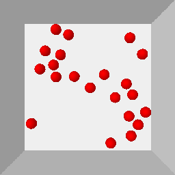
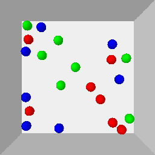

# TarGF: Learning Target Gradient Field for Object Rearrangement 

[[Website](https://sites.google.com/view/targf/)] [[Arxiv](https://arxiv.org/abs/2209.00853)]


 

The agent is given examples from a target distribution and aims at rearranging objects to increase the likelihood of the distribution. Our key idea is to learn a **target gradient field** that indicates the fastest direction to increase the likelihood from examples via score-matching. We further incoporates the target gradient field with reinforcement learning or model-based planner to tackle this task in model-free and model-based setting respectively.

The environments used in this work are demonstrated as follows:

| *Circling* | *Clustering* | *Circling + Clustering* | *Room Rearrangement* |
|  ----  | ----  | ----  | ----  |
|  |   |     |  |

This repo is the official implementation of [TarGF](https://arxiv.org/abs/2209.00853). Contents of this repo are as follows:

- [Installation](#Installation)
  - [Requirements](#Requirements)
  - [Install Global Dependencies](#Install-Global-Dependencies)
  - [Install *Ball Rearrangement* Dependencies](#Install-Ball-Rearrangement-Dependencies)
  - [Install *Room Rearrangement* Dependencies](#Install-Room-Rearrangement-Dependencies)
- [Training](#Training)
  - [Target Score Network](#Training-the-Target-Score-Network)
  - [*Ours (SAC)*](#Training-Ours-(SAC))
- [Evaluation](#Training)
  - [*Ours (ORCA)*](#For-Ours-(ORCA))
  - [*Ours (SAC)*](#For-Ours-(SAC))
- [Citation](#Citation)
- [Contact](#Contact)
- [License](#License)


## Installation

### Requirements
- Ubuntu >= 18.04
- Anaconda3 
- python >= 3.9

### Install Global Dependencies

```
git clone https://github.com/AaronAnima/TarGF

cd TarGF

conda create -n targf python=3.9

conda activate targf

conda install pytorch==1.11.0 torchvision==0.12.0 torchaudio==0.11.0 cudatoolkit=11.3 -c pytorch

conda install pyg -c pyg

pip install opencv-python tensorboard pytorch_fid ipdb imageio 
```

### Install *Ball Rearrangement* Dependencies

`pip install gym pybullet`

### Install *Room Rearrangement* Dependencies

Please follow the README in [this page](https://github.com/AaronAnima/TarGF/tree/main/Envs).

If you do not need to run this experiment, you can skip this procedure. 


## Training 


### Training the Target Score Network

For *Circling*:
```
python Runners/BallSDE.py --exp_name Circling_Score --data_name Circling_Examples --env sorting
```


For *Clustering*:
```
python Runners/BallSDE.py --exp_name Clustering_Score --data_name Clustering_Examples --env placing
```


For *Circling+Clustering*:
```
python Runners/BallSDE.py --exp_name Hybrid_Score --data_name Hybrid_Examples --env hybrid
```


For *Room Rearrangement*:
```
python Runners/RoomSDE.py --exp_name Room_Score --data_name UnShuffledRoomsMeta
```

You can also visualise the in-process results via TensorBoard:
```
tensorboard --logdir ../logs/${EXP_NAME}/tb --port 10020
```
where `${EXP_NAME}` denotes the argument following `--exp_name`.

### Training SAC with TarGF

For *Circling*:
```
python Runners/BallSAC.py --exp_name Circling_SAC --env placing --lambda_col 3.0 --lambda_sim 1.0 --score_exp Circling_Score 
```


For *Clustering*:
```
python Runners/BallSAC.py --exp_name Clustering_SAC --env sorting --lambda_col 5.0 --lambda_sim 1.0 --score_exp Clustering_Score 
```


For *Circling+Clustering*:
```
python Runners/BallSAC.py --exp_name Hybrid_SAC --env hybrid --lambda_col 5.0 --lambda_sim 1.0 --score_exp Hybrid_Score
```


For *Room Rearrangement*:
```
python Runners/RoomSAC.py --exp_name Room_SAC --score_exp Room_Score
```


## Evaluation

### For *Ours (ORCA)*

For *Circling*:
```
python Runners/BallSAC.py --exp_name Circling_ORCA --env placing --score_exp Circling_Score --mode eval
```


For *Clustering*:
```
python Runners/BallSAC.py --exp_name Clustering_ORCA --env sorting --score_exp Clustering_Score --mode eval
```


For *Circling+Clustering*:
```
python Runners/BallSAC.py --exp_name Hybrid_ORCA --env hybrid --score_exp Hybrid_Score --mode eval
```

To obtain qualitative results, change the `--mode eval` to `--mode debug`.
The results will be saved in `../logs/${exp_name}`


### For *Ours (SAC)*

For *Circling*:
```
python Runners/BallEvalSAC.py --exp_name Circling_SAC --env placing --score_exp Circling_Score --eval_mode full_metric
```


For *Clustering*:
```
python Runners/BallSAC.py --exp_name Clustering_SAC --env sorting --score_exp Clustering_Score --eval_mode full_metric
```


For *Circling+Clustering*:
```
python Runners/BallSAC.py --exp_name Hybrid_SAC --env hybrid --score_exp Hybrid_Score --eval_mode full_metric
```


For *Room Rearrangement*:
```
python Runners/RoomSAC.py --exp_name Room_SAC --score_exp Room_Score --save_video True
```

To obtain qualitative results of *Ball Rearrangmenet*, change the `--eval_mode full_metric` to `--eval_mode analysis`.
The results will be saved in `../logs/analysis_${exp_name}`.


## Citation
```
@inproceedings{wu2022targf,
  title     = {Tar{GF}: Learning Target Gradient Field for Object Rearrangement},
  author    = {Mingdong Wu and fangwei zhong and Yulong Xia and Hao Dong},
  booktitle = {Thirty-Sixth Conference on Neural Information Processing Systems},
  year      = {2022},
  url       = {https://openreview.net/forum?id=Euv1nXN98P3}
}

```

## Contact
If you have any suggestion or questions, please get in touch at [wmingd@pku.edu.cn](wmingd@pku.edu.cn) or [zfw1226@gmail.com](zfw1226@gmail.com).

## LICENSE
TarGF has an MIT license, as found in the [LICENSE](./LICENSE) file.


