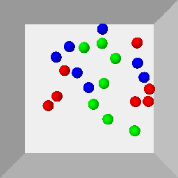

# TarGF: Learning Target Gradient Field for Object Rearrangement 

[[Website](https://sites.google.com/view/targf/)] [[Arxiv](https://arxiv.org/abs/2209.00853)]


 

The agent is given examples from a target distribution and aims at rearranging objects to increase the likelihood of the distribution. Our key idea is to learn a **target gradient field** that indicates the fastest direction to increase the likelihood from examples via score-matching. We further incoporates the target gradient field with reinforcement learning or model-based planner to tackle this task in model-free and model-based setting respectively.

The environments used in this work are demonstrated as follows:

| *Circling* | *Clustering* | *Circling + Clustering* | *Room Rearrangement* |
|  ----  | ----  | ----  | ----  |
|  |   |     |  |

This repo is the official implementation of [TarGF](https://arxiv.org/abs/2209.00853). Contents of this repo are as follows:

- [Installation](#Installation)
  - [Requirements](#Requirements)
  - [Install Global Dependencies](#Install-Global-Dependencies)
  - [Install *Ball Rearrangement* Dependencies](#Install-Ball-Rearrangement-Dependencies)
  - [Install *Room Rearrangement* Dependencies](#Install-Room-Rearrangement-Dependencies)
- [Training](#Training)
  - [Target Score Network](#Training-the-Target-Score-Network)
  - [*Ours (SAC)*](#Training-SAC-with-TarGF)
- [Evaluation](#Evaluation)
  - [*Ours (ORCA)*](#For-TarGF-(ORCA))
  - [*Ours (SAC)*](#For-TarGF-(SAC))
- [Note](#Note)
- [Citation](#Citation)
- [Contact](#Contact)
- [License](#License)


## Installation

### Requirements
- Ubuntu >= 18.04
- Anaconda3 
- python >= 3.9

### Install Global Dependencies

```
git clone https://github.com/AaronAnima/TarGF

cd TarGF

conda create -n targf python=3.9

conda activate targf

conda install pytorch==1.11.0 torchvision==0.12.0 torchaudio==0.11.0 cudatoolkit=11.3 -c pytorch

conda install pyg -c pyg

pip install opencv-python tensorboard pytorch_fid ipdb imageio 
```

### Install *Ball Rearrangement* Dependencies

```
pip install gym pybullet

cd Envs

git clone https://github.com/AaronAnima/EbOR # install Example-based Object Rearrangement (EbOR) environments

cd EbOR

pip install -e .

cd ../../
```


### Install *Room Rearrangement* Dependencies

Please follow the README in [this page](https://github.com/AaronAnima/TarGF/tree/main/Envs/Room).

If you do not need to run this experiment, you can skip this procedure. 


## Training 
We assign an argument `--log_dir $log_dir` for each experiment. The in-process results will be saved in `../logs/${log_dir}`.

### Training the Target Score Network
**Note:** *To reproduce the results in the paper, please change `--n_samples 1e3` to `--n_samples 1e5` for all the ball rearrangement experiments.*

For *Circling*:
```
python Runners/Train/BallSDE.py --log_dir Circling_Score --data_name Circling_Examples --env Circling-v0 --n_samples 1e3
```


For *Clustering*:
```
python Runners/Train/BallSDE.py --log_dir Clustering_Score --data_name Clustering_Examples --env Clustering-v0 --n_samples 1e3
```


For *Circling+Clustering*:
```
python Runners/Train/BallSDE.py --log_dir Hybrid_Score --data_name Hybrid_Examples --env CirclingClustering-v0 --n_samples 1e3
```


For *Room Rearrangement*:
```
python Runners/Train/RoomSDE.py --log_dir Room_Score --data_name UnShuffledRoomsMeta
```

You can also visualise the in-process results via TensorBoard:
```
tensorboard --logdir ../logs/${log_dir}/tb --port 10020
```
where `${log_dir}` denotes the argument following `--log_dir`.

### Training SAC with TarGF
**Note:** *To reproduce the results in the paper, please change `--residual_t0 0.01` to `--residual_t0 0.1` for all the ball rearrangement experiments.*

For *Circling*:
```
python Runners/Train/BallSAC.py --log_dir Circling_SAC --env Circling-v0 --lambda_col 3.0 --lambda_sim 1.0 --score_exp Circling_Score --residual_t0 0.01 
```


For *Clustering*:
```
python Runners/Train/BallSAC.py --log_dir Clustering_SAC --env Clustering-v0 --lambda_col 5.0 --lambda_sim 1.0 --score_exp Clustering_Score --residual_t0 0.01 
```


For *Circling+Clustering*:
```
python Runners/Train/BallSAC.py --log_dir Hybrid_SAC --env CirclingClustering-v0 --lambda_col 5.0 --lambda_sim 1.0 --score_exp Hybrid_Score --residual_t0 0.01 
```


For *Room Rearrangement*:
```
python Runners/Train/RoomSAC.py --log_dir Room_SAC --score_exp Room_Score
```


## Evaluation
We also assign an argument `--log_dir $log_dir` for each experiment. The metrics dict, trajectories and visualisations will be saved in `../logs/${log_dir}`.


### For *TarGF (ORCA)*

**Note:** *To reproduce the results in the paper, please change `--residual_t0 0.01` to `--residual_t0 0.1` and `--is_decay False` to `--is_decay True` for all the ball rearrangement experiments.*

For *Circling*:

```
python Runners/Eval/BallEvalORCA.py --log_dir Circling_ORCA --env Circling-v0 --score_exp Circling_Score --eval_mode full_metric --residual_t0 0.01 --is_decay False
```


For *Clustering*:
```
python Runners/Eval/BallEvalORCA.py --log_dir Clustering_ORCA --env Clustering-v0 --score_exp Clustering_Score --eval_mode full_metric --residual_t0 0.01 --is_decay False
```


For *Circling+Clustering*:
```
python Runners/Eval/BallEvalORCA.py --log_dir Hybrid_ORCA --env CirclingClustering-v0 --score_exp Hybrid_Score --eval_mode full_metric --residual_t0 0.01 --is_decay False
```

To obtain qualitative results, change the `--eval_mode full_metric` to `--eval_mode analysis`.
The visualisations will be saved in `../logs/${log_dir}`


### For *TarGF (SAC)*

**Note:** *To reproduce the results in the paper, please change `--residual_t0 0.01` to `--residual_t0 0.1` for all the ball rearrangement experiments.*

For *Circling*:
```
python Runners/Eval/BallEvalSAC.py --log_dir Circling_SAC --env Circling-v0 --score_exp Circling_Score --eval_mode full_metric --residual_t0 0.01
```


For *Clustering*:
```
python Runners/Eval/BallEvalSAC.py --log_dir Clustering_SAC --env Clustering-v0 --score_exp Clustering_Score --eval_mode full_metric --residual_t0 0.01
```


For *Circling+Clustering*:
```
python Runners/Eval/BallEvalSAC.py --log_dir Hybrid_SAC --env CirclingClustering-v0 --score_exp Hybrid_Score --eval_mode full_metric --residual_t0 0.01
```


For *Room Rearrangement*:
```
python Runners/Eval/RoomEvalSAC.py --log_dir Room_SAC --score_exp Room_Score --save_video True
```

To obtain qualitative results of *Ball Rearrangmenet*, change the `--eval_mode full_metric` to `--eval_mode analysis`.
The results will be saved in `../logs/analysis_${log_dir}`.


## Citation
```
@inproceedings{wu2022targf,
  title     = {Tar{GF}: Learning Target Gradient Field for Object Rearrangement},
  author    = {Mingdong Wu and fangwei zhong and Yulong Xia and Hao Dong},
  booktitle = {Thirty-Sixth Conference on Neural Information Processing Systems},
  year      = {2022},
  url       = {https://openreview.net/forum?id=Euv1nXN98P3}
}

```

## Contact
If you have any suggestion or questions, please get in touch at [wmingd@pku.edu.cn](wmingd@pku.edu.cn) or [zfw1226@gmail.com](zfw1226@gmail.com).

## LICENSE
TarGF has an MIT license, as found in the [LICENSE](./LICENSE) file.


